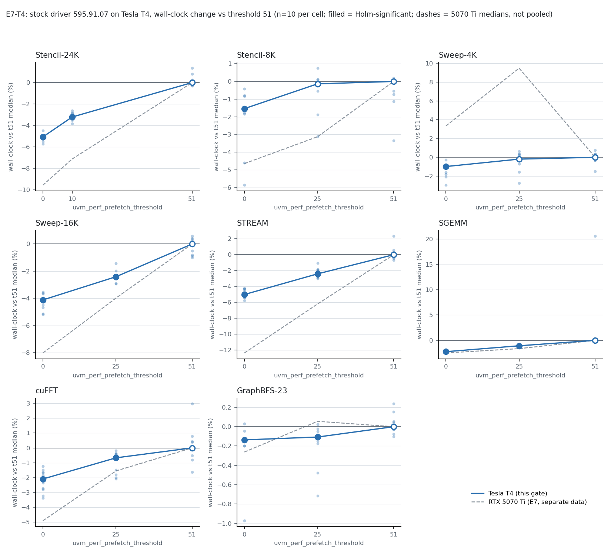

# Gate E7-T4 report: threshold replication on Tesla T4 (stock driver 595.91.07)

## Verdict

**REPLICATED.** Family A, Stencil-24K, stock-t0 vs stock-t51: **-5.07%** (median 5.514 s vs 5.808 s),
p = 1.08e-05, Holm threshold 0.0250: a Holm-significant speedup (the 5070 Ti E7 value was -9.57%, p 1.08e-05).

**Falsification trigger for the dense-workload generality claim: NOT fired.** No Holm-significant slowdown at t0 or t25 in Family B (14 tests, one Holm family).
Every Family B test has a negative delta; 12 of 14 are Holm-significant speedups, 2 (Stencil-8K t25, Sweep-4K t25) are not significant.

| expectation | result |
|---|---|
| **XA** stock-t0 faster than t51 on Stencil-24K, Holm-significant (high) | **HELD** (-5.07%, p 1.08e-05) |
| **XB** Sweep-16K, STREAM, SGEMM faster at t0 than t51, direction only (moderate; oversubscribed Stencil removed by Amendment 2) | **HELD** (Sweep-16K -4.12%, STREAM -5.01%, SGEMM -2.24%) |
| **XC** no workload significantly slower at t0 (moderate) | **HELD** (no significant slowdown in either family) |

## Scope and deviations (read before the numbers)

* Platform: Tesla T4 (sm_75), g4dn.xlarge, kernel 6.17.0-1017-aws, driver 595.91.07 open (apt debs installed from the archive pool, SHA256-verified), stock `nvidia_uvm` srcversion 6284DA42F15EDC3AB92332B on every row, threshold set at insmod and read back on every row. n = 10 per cell, 240 rows, all exit 0, 0 new dmesg lines, no STOP.
* **Pre-registration was amended twice before any timed run** (E7T4_AMENDMENT_1.md, E7T4_AMENDMENT_2.md): new time caps after an external poweroff, and **the oversubscribed Stencil was removed from Family B** because its 17.17 GiB managed allocation cannot run on this 15.4 GiB / no-swap host (OOM-killed at smoke). Family B is therefore 7 workloads, one Holm family of 14, **not the 8 workloads / 16 tests of the original E7**; this report says nothing about oversubscription on the T4 (deferred to a separate gate on a larger host). A memory stop condition (managed allocation < MemAvailable - 4 GiB) was added; it never fired.
* The 24 smoke rows ran before a machine power-cycle; the sweep ran in one detached systemd user unit after it. Smoke rows are excluded from analysis and were used only for timeouts.
* Descriptive caveat on XB/trigger scope: these are per-workload Mann-Whitney tests on process wall-clock, as pre-registered; no claim beyond the 7 workloads and 2 thresholds tested.

## Family A: Stencil-24K, stock (Holm of 2; delta = (arm - t51) / t51)

| workload | arm | median t51 (s) | median arm (s) | delta | MWU p | Holm threshold | result | Cohen d | MDE single / family | without outliers (delta, p) | outliers t51/arm | 5070 Ti delta (not pooled) |
|---|---|---:|---:|---:|---:|---:|---|---:|---|---|---|---|
| Stencil-24K | t0 | 5.808 | 5.514 | -5.07% | 1.08e-05 | 0.0250 | **faster** | -12.13 | 0.55% / 0.60% | -0.292 s, p 8.2e-05 | 2/1 | -9.57% (sig) |
| Stencil-24K | t10 | 5.808 | 5.622 | -3.21% | 1.08e-05 | 0.0500 | **faster** | -7.60 | 0.56% / 0.61% | -0.182 s, p 4.6e-05 | 2/0 | -7.13% (sig) |

## Family B: seven workloads, arms t0 and t25 vs t51 (one Holm family of 14)

| workload | arm | median t51 (s) | median arm (s) | delta | MWU p | Holm threshold | result | Cohen d | MDE single / family | without outliers (delta, p) | outliers t51/arm | 5070 Ti delta (not pooled) |
|---|---|---:|---:|---:|---:|---:|---|---:|---|---|---|---|
| Stencil-8K | t0 | 2.426 | 2.389 | -1.54% | 3.89e-03 | 0.0100 | **faster** | -1.05 | 1.83% / 2.45% | -0.036 s, p 1.6e-03 | 1/2 | -4.65% (n.s.) |
| Stencil-8K | t25 | 2.426 | 2.423 | -0.13% | 8.53e-01 | 0.0500 | n.s. | +0.02 | 1.39% / 1.86% | -0.001 s, p 9.6e-01 | 1/2 | -3.13% (n.s.) |
| Sweep-4K | t0 | 2.099 | 2.079 | -0.98% | 7.25e-04 | 0.0071 | **faster** | -1.83 | 0.87% / 1.17% | -0.021 s, p 8.7e-05 | 1/0 | +3.34% (n.s.) |
| Sweep-4K | t25 | 2.099 | 2.095 | -0.19% | 4.36e-01 | 0.0250 | n.s. | -0.44 | 1.06% / 1.43% | -0.001 s, p 4.4e-01 | 1/1 | +9.47% (n.s.) |
| Sweep-16K | t0 | 3.687 | 3.535 | -4.12% | 1.08e-05 | 0.0036 | **faster** | -6.82 | 0.75% / 1.01% | -0.152 s, p 1.1e-05 | 0/0 | -8.02% (sig) |
| Sweep-16K | t25 | 3.687 | 3.598 | -2.41% | 1.08e-05 | 0.0038 | **faster** | -4.29 | 0.65% / 0.87% | -0.089 s, p 2.5e-04 | 0/4 | -3.98% (sig) |
| STREAM | t0 | 4.067 | 3.863 | -5.01% | 1.08e-05 | 0.0042 | **faster** | -7.17 | 0.89% / 1.19% | -0.201 s, p 2.2e-05 | 1/0 | -12.37% (sig) |
| STREAM | t25 | 4.067 | 3.969 | -2.41% | 1.08e-05 | 0.0045 | **faster** | -3.34 | 0.94% / 1.26% | -0.095 s, p 2.2e-05 | 1/0 | -6.20% (sig) |
| SGEMM | t0 | 16.959 | 16.578 | -2.24% | 1.08e-05 | 0.0050 | **faster** | -0.96 | 5.76% / 7.72% | -0.379 s, p 8.2e-05 | 1/2 | -2.49% (sig) |
| SGEMM | t25 | 16.959 | 16.776 | -1.08% | 1.08e-05 | 0.0056 | **faster** | -0.69 | 5.76% / 7.72% | -0.184 s, p 1.7e-04 | 1/3 | -1.64% (sig) |
| cuFFT | t0 | 2.739 | 2.681 | -2.09% | 4.33e-05 | 0.0063 | **faster** | -2.36 | 1.26% / 1.70% | -0.057 s, p 8.7e-05 | 1/0 | -4.90% (n.s.) |
| cuFFT | t25 | 2.739 | 2.720 | -0.67% | 1.15e-02 | 0.0167 | **faster** | -1.16 | 1.26% / 1.68% | -0.018 s, p 2.2e-02 | 1/0 | -1.55% (n.s.) |
| GraphBFS-23 | t0 | 54.284 | 54.210 | -0.14% | 7.25e-04 | 0.0083 | **faster** | -1.09 | 0.26% / 0.35% | -0.074 s, p 3.3e-04 | 1/2 | -0.26% (n.s.) |
| GraphBFS-23 | t25 | 54.284 | 54.226 | -0.11% | 5.20e-03 | 0.0125 | **faster** | -1.18 | 0.22% / 0.30% | -0.047 s, p 3.6e-02 | 1/2 | +0.06% (n.s.) |

Reading notes: (1) **GraphBFS-23** is Holm-significant at both arms but tiny, -0.14% and -0.11% (0.07 s and 0.06 s of 54 s), which is below the achieved-n MDE (0.26% / 0.22%); treat it as "effectively no change" rather than as a speedup. (2) **SGEMM**: the t51 cell contains a +20% run (and t0/t25 contain outliers), which inflates the SD-based MDE (5.8%) above the observed effect (2.2%); the rank test and the without-outliers test agree on direction and significance (p 8.2e-05 / 1.7e-04). (3) **Stencil-8K t25** and **Sweep-4K t25** are the only non-significant tests, with deltas of -0.13% and -0.19%, below their MDE (1.4% and 1.1%): not distinguishable from zero at n = 10. (4) For Stencil-8K t0 and Sweep-4K t0 the without-outliers p-values (1.6e-03, 8.7e-05) are also below their Holm thresholds.

## T4 vs 5070 Ti (side by side, never pooled)

All 14 T4 Family B deltas and both Family A deltas are negative; the 5070 Ti had a negative delta in 11 of 14 Family B tests and in both Family A tests. T4 effects are smaller than the 5070 Ti's where the 5070 Ti effect was large (Stencil-24K, Sweep-16K, STREAM, cuFFT). The 5070 Ti column above is read from `results/analysis/gate_e/e7/family_{a,b}.csv`; those data were analysed in E7 on their own and are not combined with anything here.

| workload (t0 vs t51) | T4 (this gate) | 5070 Ti (E7) |
|---|---|---|
| Stencil-24K | -5.07% (sig) | -9.57% (sig) |
| Stencil-8K | -1.54% (sig) | -4.65% (n.s.) |
| Sweep-4K | -0.98% (sig) | +3.34% (n.s., positive) |
| Sweep-16K | -4.12% (sig) | -8.02% (sig) |
| STREAM | -5.01% (sig) | -12.37% (sig) |
| SGEMM | -2.24% (sig) | -2.49% (sig) |
| cuFFT | -2.09% (sig) | -4.90% (n.s.) |
| GraphBFS-23 | -0.14% (sig, below MDE) | -0.26% (n.s.) |

(The oversubscribed Stencil, -16.95% on the 5070 Ti, has no T4 counterpart.) The three sign differences are Sweep-4K t0 and t25 (5070 Ti non-significant positive, +3.34% and +9.47%; T4 -0.98% significant and -0.19% n.s.) and GraphBFS-23 t25 (5070 Ti +0.06% n.s.; T4 -0.11%, below MDE). None of the 5070 Ti positives was significant.

## Figure

`e7t4_threshold_by_workload.png` / `.pdf`: per workload, each run as % change vs the workload's t51 median (points), cell medians joined (filled = Holm-significant vs t51), dashed gray = 5070 Ti E7 medians (separate data).

## Cross-version observation (descriptive, not tested)

This session's Stencil-24K stock-t51 median is **5.808 s** (n = 10, driver 595.91.07) versus **4.185 s** for the old T4 C0 runs (driver 595.71.05, GATE_T1_REPORT.md): +38.8%. Different driver version, kernel, instance and session; no inference drawn.

## Provenance

Raw rows `e7t4_runs.csv` (240), analysis output `primary_report.txt`, `analyze_stdout.txt`, `family_a.csv`, `family_b.csv`, order `e7t4_order.csv` (sha256 in `e7t4_order.sha256`), timeouts `e7t4_timeouts.json`, chain log `e7t4_chain.log`.
Positive control (analyzer on the 5070 Ti E7 data): PASS, -9.57%, p 1.08e-05 (`e7t4_positive_control.txt`).
